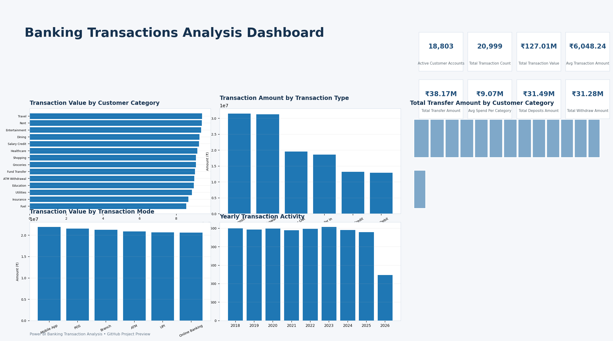

# 📊 Banking Transaction Analysis — Power BI

An interactive Power BI dashboard analysing 20,999 banking transactions across transaction types, channels, spending categories, and time (2018–2026).

## 📷 Dashboard

*Top row: KPI cards, value by transaction type, value by transaction mode. Bottom row: value by category, transfer amount by category (treemap), transactions per year (2026 is a partial year). Individual charts are in [`screenshots/`](screenshots/).*

## 🎯 Business questions

1. What is the total transaction value and volume?
2. Which channel (mode) carries the most value?
3. How do transaction types compare, and do credits and debits balance?
4. Which spending categories are largest, and which receive the most transfers?
5. How does activity change over time?

## 📁 Repository contents

| Path | Description |
| --- | --- |
| `Final Dashboard Banking Analysis.pbix` | Power BI dashboard (open with Power BI Desktop) |
| `cleaned_banking_dataset.csv` | Cleaned data in CSV form, plus an `is_future_date` flag |
| `cleaned banking dataset.xls` | Original cleaned workbook (legacy format) |
| `Dashboard_Screenshot.png` | All six dashboard visuals merged into one image |
| `screenshots/` | The six individual chart screenshots |
| `merge_screenshots.py` | Rebuilds `Dashboard_Screenshot.png` from `screenshots/` |

## 🗂️ Dataset

20,999 rows, 7 columns, no missing values, no duplicate rows or transaction IDs. Dates run from 2018-01-01 to 2026-12-06.

| Column | Description |
| --- | --- |
| `transaction_id` | Unique transaction ID |
| `account_id` | Customer account ID (18,803 unique) |
| `txn_date` | Transaction date |
| `txn_type` | Deposit, Withdrawal, Transfer In, Transfer Out, Interest Credit, Fee Debit |
| `amount` | Transaction amount (₹50.27 to ₹63,126.64) |
| `Transaction_Mode` | UPI, Mobile App, POS, Branch, ATM, Online Banking |
| `Customer_category` | Spending/purpose category (14 values, e.g. Travel, Rent, Salary Credit) |
| `is_future_date` | Added flag: `True` if the date is after 2026-10-03 |

## 📌 KPIs

| KPI | Value |
| --- | ---: |
| Total Transaction Value | ₹127.01M |
| Transaction Count | 20,999 |
| Active Customer Accounts | 18,803 |
| Average Transaction Amount | ₹6,048.24 |
| Total Deposits | ₹31.49M |
| Total Withdrawals | ₹31.28M |
| Total Transfers (In + Out) | ₹38.17M |
| Average Value per Category | ₹9.07M |

*Total Transaction Value is gross turnover: every transaction counts, whether money came in or went out. All figures were verified against the dataset with Python.*

## 🔍 Insights

- **Credits and debits are nearly balanced.** Credits (Deposit, Interest Credit, Transfer In) total ₹63.32M and debits (Withdrawal, Fee Debit, Transfer Out) total ₹63.69M, a net outflow of about ₹0.37M (0.6% of turnover).
- **Deposits and withdrawals dominate by type**, each around ₹31M and about 5,240 transactions. Fee Debit (₹12.87M) and Interest Credit (₹13.20M) are the smallest.
- **Mobile App is the top channel** at ₹21.95M (17.3% of value), only about 6.5% above the lowest, Online Banking (₹20.61M).
- **Travel is the top category by total value** (₹9.41M), about 10% above the lowest, Fuel (₹8.55M). Travel and Rent are almost tied.
- **Healthcare receives the most transfer value** (₹3.11M of ₹38.17M), followed by Travel (₹2.89M) and Rent (₹2.85M). Utilities is lowest (₹2.42M).
- **Volume is flat year to year**, about 2,400–2,540 transactions per full year from 2018 to 2025. 2026 is a partial year.

## ⚠️ Data notes and limitations

- **Future-dated records:** 115 transactions (₹0.63M) are dated after 2026-10-03, up to 2026-12-06. They are flagged with `is_future_date` but not removed, so the KPIs above match the dashboard.
- **Category and type are independent:** `Customer_category` does not constrain `txn_type`. For example, "Salary Credit" appears with Withdrawals and Fee Debits. Treat category as a label, not a classification of direction.
- **Naming:** `Customer_category` describes spending purpose, not customer segment. "Average Spend per Category" also includes credits.
- **Patterns are weak:** values are spread very evenly across channels, categories, and years, which suggests a synthetic dataset. Rankings are real but the gaps are small, so avoid strong business conclusions.

## 🛠️ Tools

Power BI, Power Query, DAX, Python (verification).

## 🚀 Possible next steps

- Add a net-flow (credits minus debits) KPI and monthly trend
- Add a date slicer that excludes future-dated rows
- Rename `Customer_category` to `Spending_category` in the model

## 👤 Author

**Aryan Wasule** — Computer Engineering student, NIT Polytechnic, Nagpur
[GitHub](https://github.com/mr-aryanwasule) · [LinkedIn](https://www.linkedin.com/in/aryanwasule-data)
